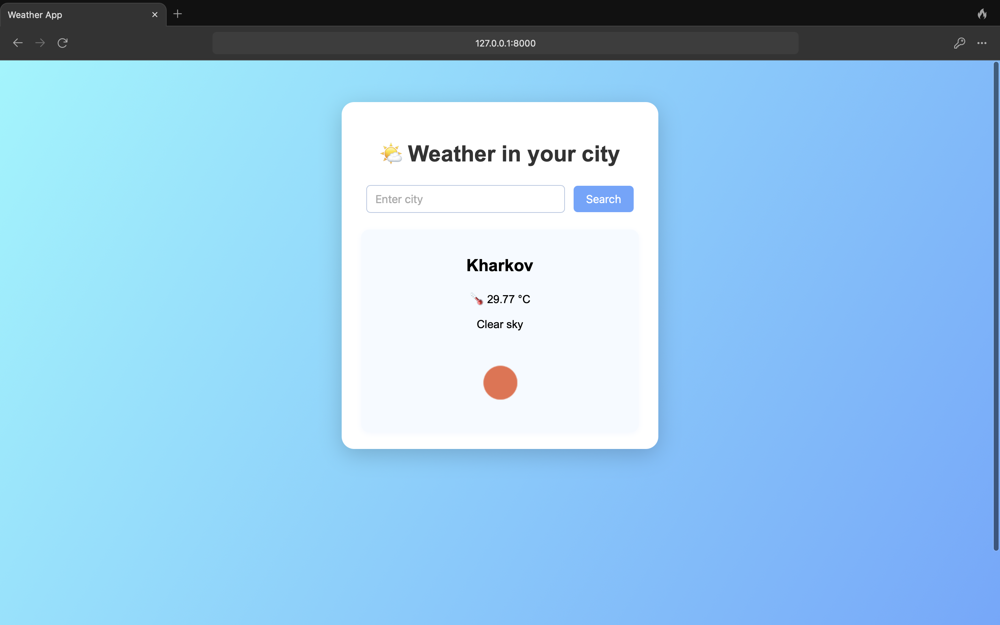

# WeatherApp ☀️🌧️

A simple and stylish Django web application for checking the current weather in any city worldwide.

---

## 🚀 Features

- 🔍 Search weather by city name
- 🌡️ Displays temperature, weather description, and icon
- 🎨 Modern, responsive design
- 🔒 API key is securely stored in environment variables

---

## 🛠️ Getting Started

### 1. Clone the repository

```bash
git clone https://github.com/UlyaFed/weatherapp.git
cd weatherapp
```

### 2. Create and activate a virtual environment

```bash
python3 -m venv venv
source venv/bin/activate
```

### 3. Install dependencies

```bash
pip install -r requirements.txt
```

### 4. Set up environment variables

Create a `.env` file in the project root and add your [OpenWeatherMap](https://openweathermap.org/) API key:

```
OPENWEATHER_API_KEY=your_api_key_here
```

### 5. Run the server

```bash
python manage.py runserver
```

Open [http://127.0.0.1:8000/](http://127.0.0.1:8000/) in your browser.

---

## 📸 Screenshot



---

## 📄 License

This project is licensed under the MIT License.

---

**Author:** Uliana Fedak
